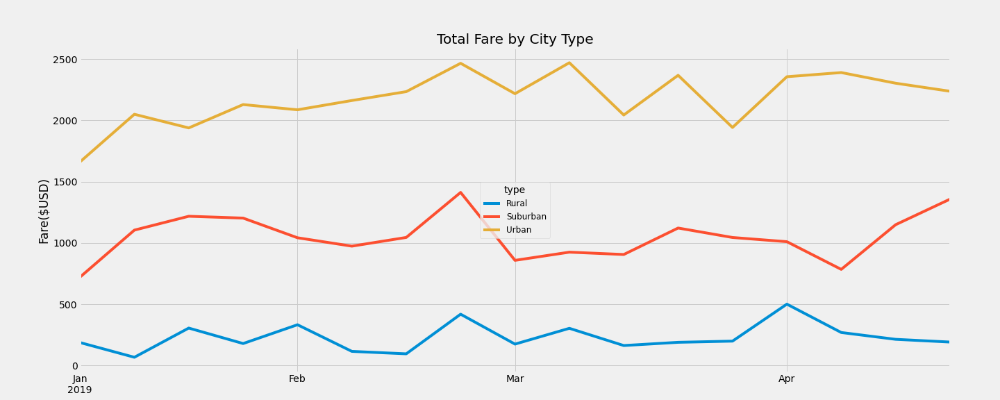

# PyBer_Analysis
## Overview of Project
PyBer, a Python based ride-sharing app company wants to perform an exexploratory analysis on data in some very large CSV files. The task is to create several types of visualizations to tell a compelling story about the data. Using Pandas’ libraries, the jupyter notebook, and Matplotlib task is to write Python scripts to create a variety of charts that showcase the relationship between the type of city and the number of drivers and riders as well as the percentage of total fares, riders, and drivers by type of city. The purpose of this analysis and visualizations is to help PyBer improve access to ride-sharing services and determine affordability for underserved neighborhoods.

## Results
### A ride-sharing summary by city type
- Rural city type had the highest Average Fare per ride and Average Fare per Driver followed by Suburban and Urbancity type respectively.
- Urban city type had the highest Number of Riders, Number of Drivers, and Total Fare followed by Suburban and Ruralcity type respectively.
- Urban city type had a higher Number of Drivers than the Number of Riders. 

### Total fares for each city type over the first 4 months of 2019
- Urban had the highest Total Fare over the 4 months followed by Suburban and Rural respectively. 
- Starting of Jan had growth for Urban and Suburban and decline for Rural
- End of Feb had a peak for all city types 

## Summary
Here are three business recommendations for the CEO for addressing any disparities among the city types: 
- Urban cities had a higher number of Drivers than Riders. There are more options available for riders which can be used for advertisement purposes.
- Urban cities had the highest Total Fare over the 4 months resulting in higher revenue compared to other city types. The company should focus on making the application available for a higher number of Urban cities.
- Rural cities had the highest Average Fare per ride and Average Fare per Driver which can be used to attract more drivers.